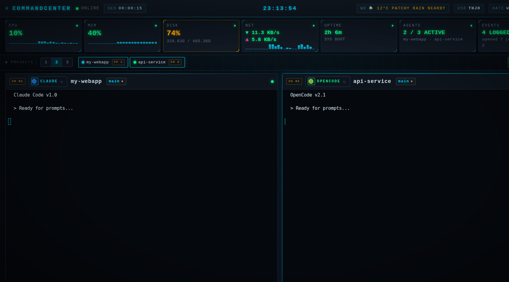

# ⚡ COMMANDCENTER

A mission-control dashboard for managing multiple AI coding agents side-by-side. Run Claude, OpenCode, and Codex in real terminal panels with live system metrics, git status, and session persistence.



## Features

- **Multi-Panel Terminals** — Run 1-3 AI agents simultaneously in real xterm.js terminals
- **Agent Switching** — Cycle between Claude, OpenCode, and Codex per panel with one click
- **Tmux Persistence** — Sessions survive browser refresh; instant resume when you return
- **Live System Metrics** — CPU, RAM, disk, and network monitoring with sparkline graphs
- **Git Status** — Real-time branch name and dirty state indicators per project
- **Project Management** — Add/remove projects via file browser, switch projects per panel
- **Weather Display** — Current conditions in the header
- **Event Log** — Track agent activity (tool use, errors, thinking states)
- **Channel Badges** — See which projects are assigned to which panels (CH1, CH2, CH3)

## Quick Start

```bash
# Clone the repo
git clone https://github.com/yourusername/commandcenter.git
cd commandcenter

# Create virtual environment
python3 -m venv .venv
source .venv/bin/activate

# Install dependencies
pip install -r requirements.txt

# Run
python server.py

# Open http://localhost:5050
```

### Desktop App

Install as a standalone desktop application (creates shortcut, installs icon, auto-starts server):

```bash
./install-desktop.sh
commandcenter
```

**macOS:**
```bash
./install-desktop-macos.sh
# Then open ~/Applications/CommandCenter.app or add to Dock
```

**Windows:** Use WSL (Windows Subsystem for Linux) — native Windows is not supported due to PTY limitations.

## Requirements

- **Linux** or **macOS** (Windows requires WSL)
- Python 3.10+
- tmux (recommended for session persistence)
- Default browser (Firefox, Chrome, Edge, etc.)
- At least one AI coding agent installed

### Supported Agents

| Agent | Command | Install |
|-------|---------|---------|
| Claude | `claude` | [Claude Code CLI](https://docs.anthropic.com/en/docs/claude-code) |
| OpenCode | `opencode` | [opencode](https://github.com/opencode-ai/opencode) |
| Codex | `codex` | `npm install -g @openai/codex` |

## Configuration

### Projects

Edit `config/projects.json` to configure your projects:

```json
{
  "projects": [
    {
      "name": "my-app",
      "path": "/home/user/projects/my-app",
      "agent": "claude",
      "launch_on_start": true
    },
    {
      "name": "backend",
      "path": "/home/user/projects/backend",
      "agent": "opencode",
      "launch_on_start": true
    }
  ]
}
```

### Environment Variables

| Variable | Default | Description |
|----------|---------|-------------|
| `CC_PORT` | `5050` | Server port |

## Usage

### Panel Layout
Click **1**, **2**, or **3** in the projects strip to change the number of visible terminal panels.

### Switching Projects
- Click a project chip in the strip to open it in the focused panel
- Click the project name in a panel header to open the project palette
- Use **+ ADD PROJECT** to browse and add new project folders

### Switching Agents
Click the agent button in any panel header to cycle through: Claude → OpenCode → Codex

### Keyboard Shortcuts
- `Ctrl+Alt+Tab` or `Ctrl+Alt+→` — Cycle focus between panels
- `Shift+Scroll` — Scroll terminal history

## Architecture

```
server.py           # Flask + Socket.IO server
templates/
  index.html        # Single-page app (HTML + CSS + JS)
services/
  pty_bridge.py     # PTY ↔ WebSocket bridge
  system.py         # System metrics via psutil
  weather.py        # Weather API (wttr.in)
  git.py            # Git status polling
agents/
  switcher.py       # Agent cycling logic
launcher/
  tmux.py           # Tmux session management
config/
  projects.json     # Your project configuration (gitignored)
```

### Tech Stack
- **Backend**: Flask, Flask-SocketIO, gevent
- **Frontend**: Vanilla JS, xterm.js, Socket.IO client
- **Terminal**: Real PTY via Python pty module, optional tmux wrapper

## Status Rail

The top rail shows real-time system metrics:
- **CPU** — Usage percentage with sparkline history
- **MEM** — RAM usage with sparkline history
- **DISK** — Disk usage and capacity
- **NET** — Network RX/TX bandwidth
- **UPTIME** — System uptime
- **AGENTS** — Count of active projects
- **EVENTS** — Event log count

## License

MIT
